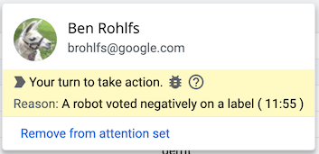
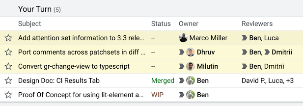

# Gerrit Code Review - Attention Set

使用 [Monorail 模板](https://bugs.chromium.org/p/gerrit/issues/entry?template=Attention+Set) 来报告 bug 或反馈一些信息。

## Whose turn is it?

Code Review is a turn-based workflow going back and forth between the change
owner and reviewers. For every change Gerrit maintains an "Attention Set" with
users that are currently expected to act on the change. Both on the dashboard
and on the change page, this is expressed by an arrow icon before a (bolded)
user name:


While the attention set brings clarity to the process it also comes with
responsibilities and expectations. To provide the best outcome for all users, we
suggest following these principles:

* Reviewers are expected to respond in a timely manner when it is their turn. If
  you don't plan to respond within ~24h, then you should either remove yourself
  from the attention set or you should at least send a clarification message to
  the change owner.
* Change owners are expected to manage the attention set of their changes
  carefully. They should make sure that reviewers are only in the attention set
  when the owner waits for a response from them.

On the plus side you can strictly ignore everyone else's changes, if you are not
in the attention set. :-)

### Rules

To help with the back and forth, Gerrit applies some basic automated rules for
changing the attention set:

* If reviewers are added to a change, then they are added to the attention set.
  * Exception: A reviewer adding themselves along with a comment or vote.
* If an active change is submitted, abandoned or reset to "work in progress",
  then all users are removed from the attention set.
* Replying (commenting, voting or just writing a change message) removes the
  replying user from the attention set. And it adds all participants of comment
  conversations that the user is replying to.
* If a *reviewer* replies, then the change owner (and uploader) are added to the
  attention set.
* For merged and abandoned changes the owner is added only when a human creates
  an unresolved comment.
* Only owner, uploader, reviewers and ccs can be in the attention set.
* The rules for service accounts are different.

**!IMPORTANT!** 
*These rules are not meant to be super smart and to always do the right thing, e.g. if the change owner sends a reply, then they are often expected to individually select whose turn it is.*

Note that just uploading a new patchset is not a relevant event for the
attention set to change.

### Interaction

There are three ways to interact with the attention set: The attention icon,
the hovercard of owner and reviewer chips and the "Reply" dialog.

*The attention icon* can be used to quickly remove yourself (or someone else)
from the attention set. Just click the icon, and it will disappear:


*The hovercard* (on both the Dashboard and Change page) contains information
about whether, why and when a user was added to the attention set. It also
contains an action for adding/removing the user to/from the attention set.



*The reply dialog* contains a section for controlling to whom the turn should be
passed.


If you click "MODIFY", then the section will
expand and you can select and de-select users by clicking on their chips.
Whatever you select here will be the new state of the attention set for this
change. As a change owner make sure to remove reviewers that you don't expect to
take action.


### Bots

The attention set is meant for human reviews only. Triggering bots and reacting
to their results is a different workflow and not in scope of the attenion set.
Thus members of the "Service Users" group will never be added to the
attention set. And replies by such users will only add the change owner (and
uploader) to the attention set, if it comes along with a negative vote.

### Dashboard

The default *dashboard* contains a new section at the top called "Your Turn". It
lists all changes where the logged-in user is in the attention set. When you are
a reviewer, the change is highlighted and is shown at the top of the section.
The "Waiting" column indicates how long the owner has already been waiting for
you to act.



As an active developer, one of your daily goals will be to iterate over this
list and clear it.


Note that you can also navigate to other users' dashboards to check their
"Your Turn" section.

### Emails

Every email begins with `Attention is currently required from: ...`, so you can
identify at a glance whether you are expected to act.

You can even change your email notification preferences in the user settings to
only receive emails when you are in the attention set of a change:


If you prefer setting up customized filters in your mail client, then you can
make use of the `Gerrit-Attention:` footer lines that are added for every user
in the attention set, e.g.

```
Gerrit-Attention: Marian Harbach <mharbach@google.com>
```

### Assignee

While the "Assignee" feature can still be used together with the attention set,
we do not recommend doing so. Using both features is likely confusing. The
distinct feature of the "Assignee" compared to the attention set is that only
one user can be the assignee at the same time. So the assignee can be used to
single out one person or escalate, if there are multiple reviewers. Since
*every* reviewer in the attention set is expected to take action, singling out
is not likely to be important and also still achievable with the attention set.
Otherwise "Assignee" and "Attention Set" are very much overlapping, so we
recommend to only use one of them.

If you don't expect action from reviewers, then consider adding them to CC
instead.

"Assignee" 功能可以通过 `change.enableAttentionSet` 参数进行设置。 

### Bold Changes / Mark Reviewed

Before the attention set feature, changes were bolded in the dashboard when
*something* happened and you could explicitly "mark a change reviewed" on the
change page. This former way of keeping track of what you should look at has
been replaced by the attention set.

### For Gerrit Admins

The Attention Set will be part of the upcoming 3.3 release (late 2020). It
is enabled by default, but you can disable it by setting
`change.enableAttentionSet` to false.

As part of Gerrit 3.3 upgrade, the user group "Non-Interactive Users" is
renamed "Service Users". For a new installation, the group is automatically
created upon initialization.

### Important note for all host owners, project owners, and bot owners

If you are a host/project owner, please make sure all bots that run against your
host/project are part of the "Service Users" group.

If you are a bot owner, please make sure your bot is part of the "Service Users"
group on all hosts it runs on.

To add users to the "Service Users" group, first ensure that the group exists on
your host. If it doesn't, create it. The name must exactly be "Service Users".

To create a group, use the Gerrit UI; BROWSE -> Groups -> CREATE NEW.

Then, add the bots as members in this group. Alternatively, add an existing
group that has multiple bots as a subgroup of "Service Users".

To add members or subgroups, use the Gerrit UI; BROWSE -> Groups ->
search for "Service Users" -> Members.


