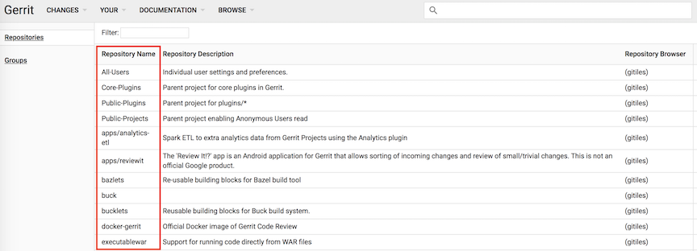
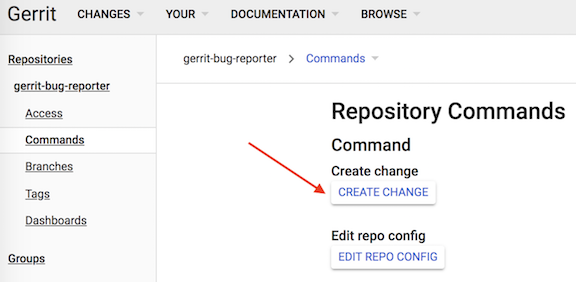
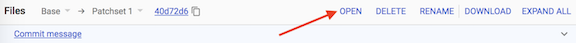
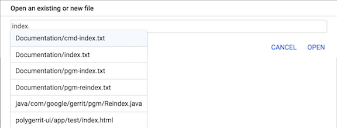
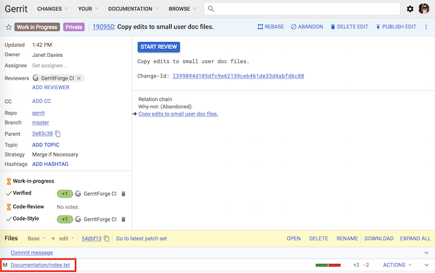
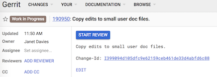
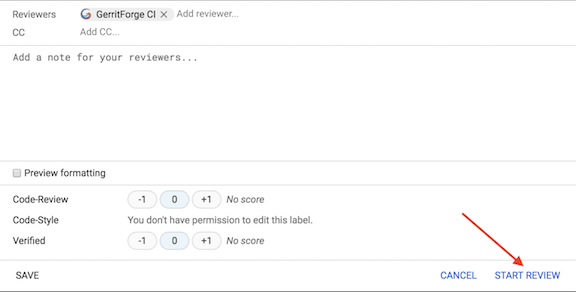
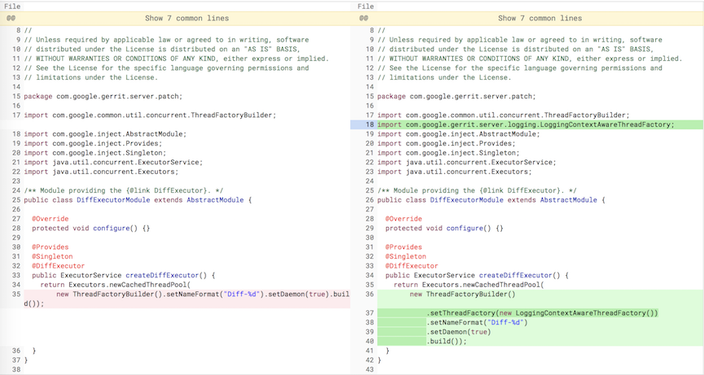

# 在 Gerrit 页面上创建和编辑 change

## Overview

下面的内容描述了如何在 Gerrit 页面上创建和编辑 change。网页上比较适合处理改动不大的 change，并且不需要把代码下载到本地，而是在网页上直接操作。

如果要了解更多，可以参考 [用户基本指南](intro-user.md)。

## 创建 Change

Gerrit 网页上创建 change 的过程:

 - 在 Gerrit 上，如 [Gerrit Code Review](http://gerrit-review.googlesource.com) ，依次点击 Browse > Repositories.

 - 点击要使用的 project 名字。也可以通过搜索的方式找到要使用的 project。



 - 在这个 project 的左侧导航面板中点击 Commands 按钮



 - 点击 `Create Change` 按钮

 - 在创建 Change 窗口, 输入下面信息:

    为新的 change 选择 branch: 明确 change 的目的分支。

    为 change 提供 base 的 commit-id: 此处可以为空。


 重要: Git 使用唯一的 SHA-1 值识别 commit (换句话说，Git commit 会生成新的 SHA-1 值)。 这个值和 Change-Id 不同，Change-Id 用于识别 change。

    commit-msg: 简要描述一些 change 的信息。使用 commit-msg 的格式，可以参考 [向 Gerrit 社区贡献](dev-contributing.md) 的 `commit message` 章节。第一行为主题，因为用户的 dashboard 和 `git log --pretty=oneline output` 命令结果便于查看。

    Private change: 把 change 的属性设置为 private，只有 owner 及 指定的人员才可以访问。

 - 在创建 Change 窗口, 点击 Create 按钮。Gerrit 会创建一个 WIP 状态的 change，在 change 被评审之前，此 change 仍然是 WIP 状态并且只能在本人的 dashboard 中出现。另外，WIP 状态下的 change 的相关邮件的邮件提醒会自动关闭。

 - 添加待评审的文件。

## 添加待评审文件

待评审的文件可以添加到未合入代码库的 change 中。

操作如下:

 - 页面右上角，点 Edit 按钮
 - 在页面中间的文件栏，点击 Open 按钮



 - 在打开的窗口中，如下操作:

    添加一个已经存在的文件:

        文本框中输入新文件的名称，如果是文件的部分名称，系统会自动扩展。



        选择要添加的文档并点击 Open 按钮。
**或者**

    输入新文件的名称，然后点击 Open 按钮。T

## 修改 Change

修改 change 中的文件：

 - 在 change 页面，点击文件名称。如果是添加一个新文件，那么会显示一个空白的页面。如果添加一个已存在的文件，那么页面会自动加载文件内容。

 - 更新文件后，点击 Save 按钮。一定要点击 Save 按钮。

 - 然后点击 Close 按钮。

此时，文件已经添加到了 change 中，并且在文件列表中有显示。文件前方的字符表示了对文件的操作行为。如下：

    M: Modified(修改)
    A: Added(新增)
    D: Deleted(删除)



 - 完成编辑和添加文件后，点击 `Stop Editing` 按钮

 - 再点击 `Publish Edit` 按钮，会把当前的编辑作为一个新的 patch-set 进行发布。

如果不喜欢编辑后的文件，可以点击 `Delete Edit` 按钮进行删除。

## Starting the Review

当开始对 change 进行 review 的时候, Gerrit 自动移除 WIP 状态后就可以评审 change 了。

如何启动 review:

 - 打开 change 页面并点击 `Start Review` 按钮



 - 在新打开的窗口中:

    输入评审人员的名字
    输入 change 的描述信息
    点击 `Start Review` 按钮



现在，评审人员就可以对 change 进行 review 了。

## review Change

可以使用 side-by-side diff 页面.



有可能会有多个 patch-set 存在。例如：当前有 9 个 patch-set，此时页面上修改了一个文件并发布后，序列如下：

1 2 3 4 5 6 7 8 9 edit 10

## 搜索 Pending Edits 状态的 change

搜索 Pending Edits 状态的 change，搜索栏中输入搜索条件：`has:edit`

更多搜索操作，可以参考 [changes 搜索](user-search.md)。

## Modifying Changes

### Rebasing a Change Edit

在 change 页面编辑 patch-set 的时候，此时，另一用户已经成功上传了一个新的 patch-set，那么编辑的 patch-set 需要执行 rebase 操作后，才能将其发布。

rebase change:

 * 打开 change 页面并点击 `Rebase Edit` 按钮。

如果 rebase 过程中产生了冲突，需要在本地解决冲突。

本地解决冲突后，用命令行将其推送到 gerrit 上，不过需要加参数 `edit` ，如：

```
$ git push host HEAD:refs/for/master%edit
```

### 下载 patch-set

用户可以下载 patch-set。不过需要安装 plugin: `download-commands` ，并且用户还要有 change 的 accessDatabase 权限。权限可参考  [访问控制](access-control.md) 的 accessDatabase 章节。

下载 change:

 - 打开 change 页面, 点击 `More` 图标并点击 `Download patch` 按钮
 - 从下拉菜单中选择下载方式
 - 命令行窗口中粘贴命令后即可下载


