# Review UI

评审 changes 是一项重要的任务，Gerrit　的页面提供了很多与评审相关的功能，使评审更加便捷．此文主要介绍 Gerrit 的 review-UI 一些功能．

## Change Screen

change-screen 显示了 change 的一些细节，并提供了一些功能按钮．

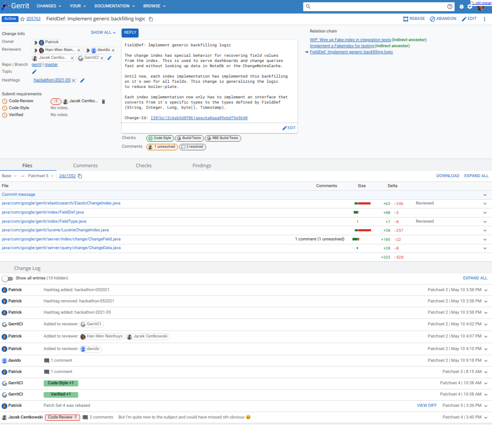

### Commit Message Block

下图中框框的内容在 change 中是非常重要的信息：change-ID 的序号(如：55060)，change-status(在change-ID 的序号的右侧，如：needs code-view)，以及 commit-msg．

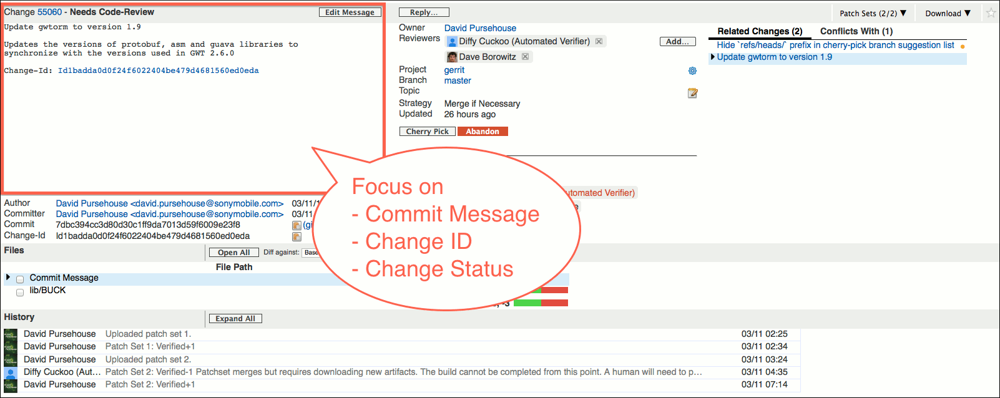

change-ID 的序号是 change 的链接．

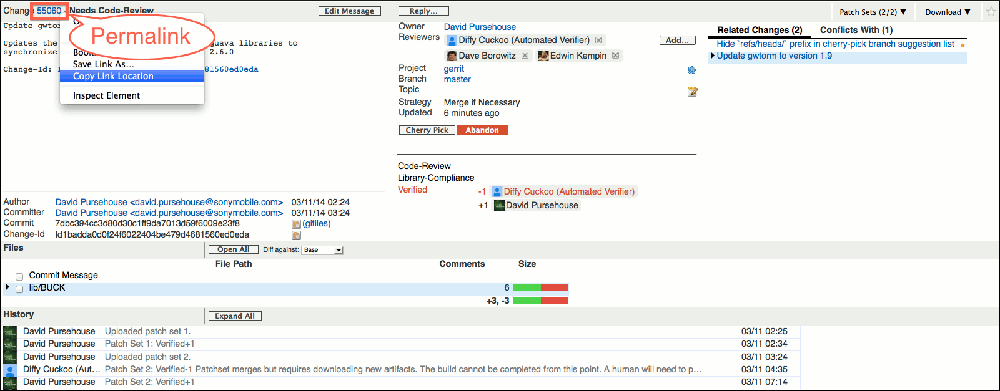

change-status 显示了 change 当前所处的状态:

 * `Needs <label>`:

　change 仍在评审状态中，需要所显示 label 的打分．

 * `Not <label>`:

　change 仍在评审状态中，但所显示的 label 的评审被否决了，导致 change 不能合入．

 * `Not Current`:

　显示的不是最新的 patch-set．

　只能在最新的 patch-set 上打分，不能在历史的 patch-set 上打分

 * `Ready to Submit`:

　change 的各个评审项已通过，待点击 submit 按钮合入

 * `Merged`:

　change 已经合入了代码库

 * `Abandoned`:

　change 被 abandon

### Commit Info Block

下图的框框内容显示了当前 commit 的一些信息．

框框中的 author 和 committer 信息会链接到这个人处于当前 change 状态的 change 列表．

点击 commit ID, parent commit(s) 和 [changeid](user-changeid.md) 后面的图标，可以将其对应的信息进行复制．

如果集成了 Git 的网页视图工具, 比如：gitweb ，Gitiles, 那么点击后会跳转到 commit 所在的网页视图工具页面．

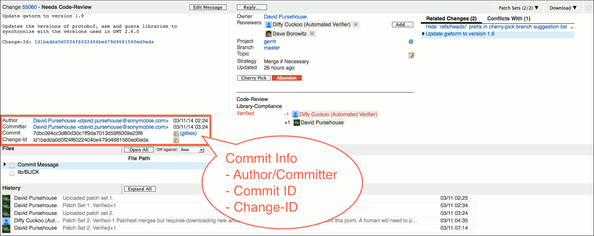

如果是 merge　节点，那么会有一个高亮的图标提示．

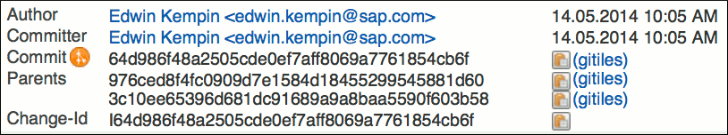

### Change Info Block

下图框框中的内容包含了 change 一些信息和对 change 的一些操作．

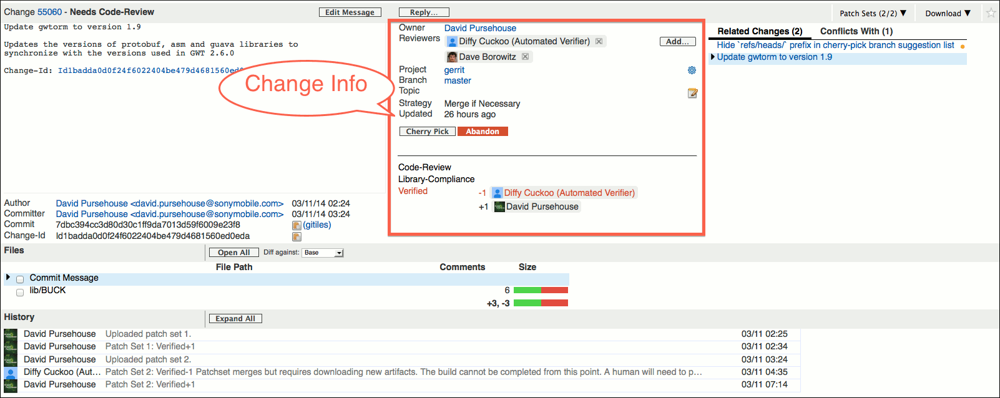

 * Change Owner:

　点击 change-owner 的链接，可以看到 owner 的当前 review 状态的 change 列表．

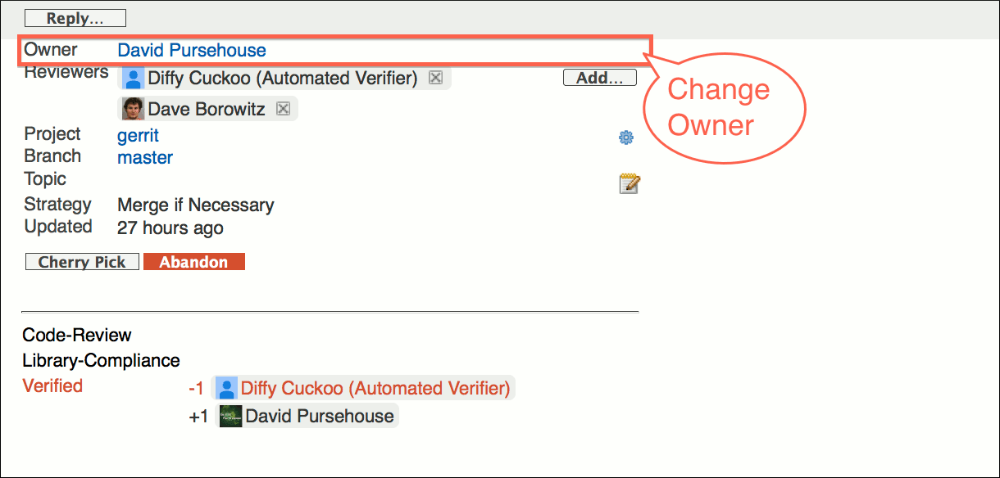

 * Reviewers:

 显示 change 评审人员列表．

 鼠标移动到评审人员上，会有允许打分项的提示．

 点击 `Add...` 按钮可以添加新的评审人员. 在弹出的文本框中输入用户和群组名称的时候，系统会自动补齐．

 点击 `x` 图标，可以将评审人员从列表中移除．移除评审人员后，评审人员的打分也会相应被移除．change 的 message 中会记录被移除的打分信息．

 移除评审人员是受权限控制的:

    * 用户可以移除自己
    * change-owner 可以移除 0 和正分
    * 有权限的用户，, the branch-owner, project-owner 和管理员可以移除任何一个评审人员

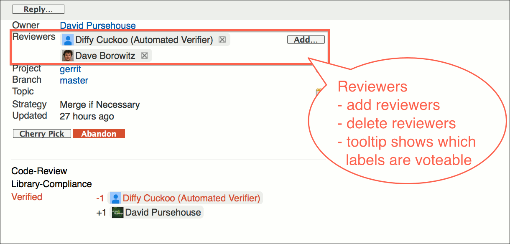

 * Project / Branch / Topic:

　点击 change 页面中 project 的内容，会跳转到这个 project 的 open 状态下的 change 的视图．

　点击 branch 名称，会跳转到这个 branch 当前 change 状态的 change 列表的页面．

　topic 在 branch 的下面显示．点击后面的编辑按钮，可以编辑 topic 的信息，不过这个权限是受控的．如果要在关闭状态的 change 上编辑 topic，要勾上 `Edit Topic Name` 权限的 `force` 标识．

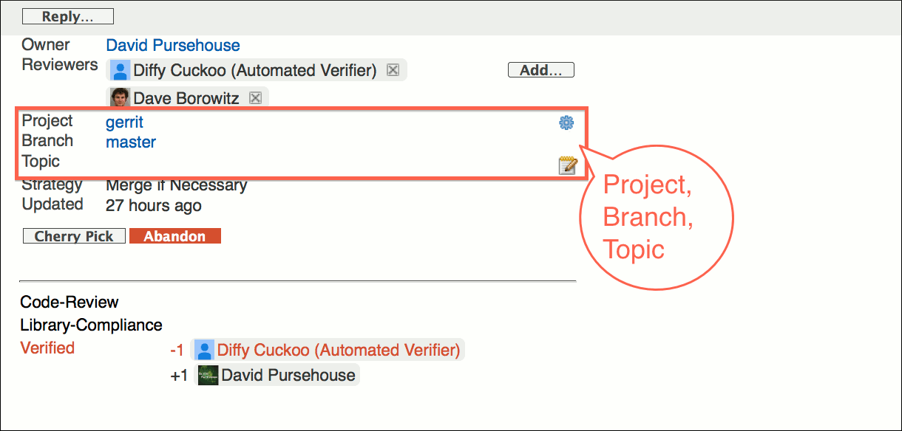

 * Submit Strategy:

　submit-strategy 用来显示 change 合入时的方式，并且只有 open　状态的 change 才会显示．

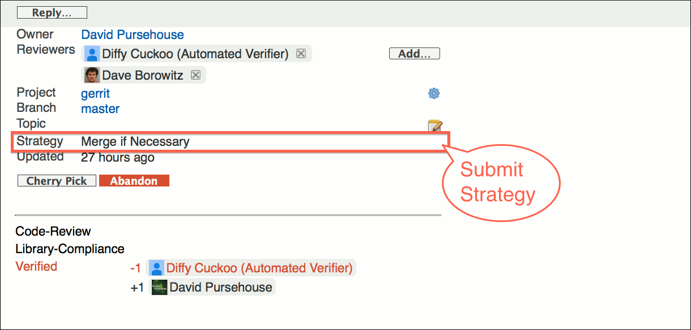

　如果 change 由于路径冲突导致不能合入的话，会有红色加粗字体 `Cannot Merge` 进行提示.

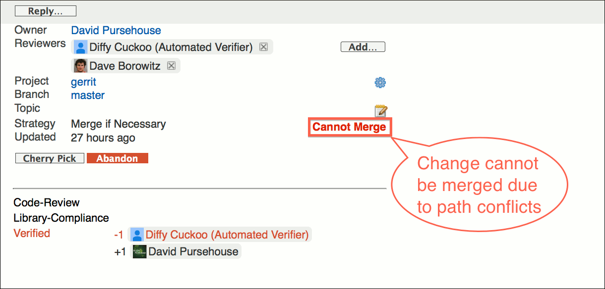

 * Time of Last Update:

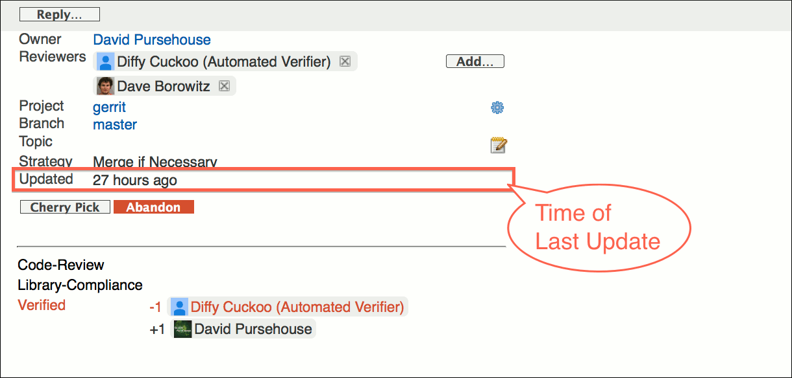

 * Actions:

　change 的操作依赖于 change 的状态及用户权限，否则一些执行操作的按钮是不可见的。

　* `Submit`:

　将 change 添加到合入的队列中，然后将其合入到目的代码分支上。

　`Submit` 按钮只有在评审条件都通过并且有此权限的情况下才可见。

    * `Revert`:

　通过创建新 change 的方式来 revert change。

　`Revert` 按钮只有 change 已经合入的状态下才可见。

　当点击 `Revert` 按钮后，会弹出一个窗口，用来输入原因。

　一旦 revert change 被创建，原 change 的作者和评审人员会自动作为评审人员添加到新 change 的评审人员列表中。

    * `Abandon`:

　abandons change.

　`Abandon` 按钮受权限控制，并且只有 change 是 open 状态下才可见。

　当 change 被 abandon 的时候，会弹出一个窗口，用来输入原因。

    * `Restore`:

　Restores the change.

　`Restore` 按钮受权限控制并且只有 change 在 abondan 状态下才可见。

　change 被 restor 时，会弹出窗口，用来填写原因。

    * `Rebase`:

　rebases change。rebase 需要启用 content-merge 功能后才可以使用。如果 rebase 失败，那么需要在本地手动解决冲突。

　如果 change 不依赖其他 open 状态下的 change, 那么 commit 会 rebase 到目的分支的顶端。

　如果 change 依赖其他 open 状态下的 change, 那么 commit 会 rebase 到所依赖的 change 上。

　rebase 后，change 的父节点有可能会改变。比如基于最新代码生成的两个 change ，A 和 B，当 A 合入后，再合入 B ，那么 B 的父节点就变成了 A。

　`Rebase` 按钮受权限控制。merge 节点不支持 rebase 操作。

    * `Cherry-Pick`:

　将 change cherry-pick 到其他的分支。可在弹出的窗口中选择目的分支。cherry-pick 会在目的分支生成一个新的 change。

　cherry-pick 的目的分支有可能与原分支相同，此情况下，可以移除 change 间的依赖关系。

　cherry-pick 的权限同上传/生成 change 的权限。

    * `Delete Change` / `Delete Revision`:

　delete change.

　对于 open 或者 abandoned 状态的 change, 如果有权限的话，可以进行删除。

    * 插件还可以提供其他的操作。

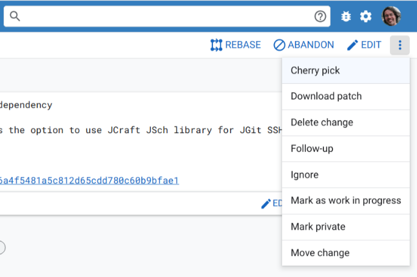

 * Labels & Votes:

　打分时，显示绿色为通过，红色为不通过。

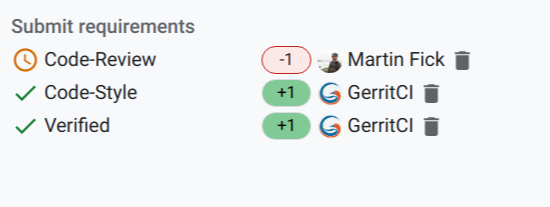

### File List

patch-set 中所修改的文件列表。

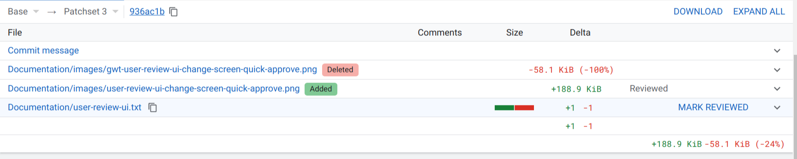

另外，文件列表中还包含了一种文件：magic-files，此文件虽然是 Gerrit 产生的，但并不存在在 git 仓中。magic-files 包含了一些 commit 的数据，这些数据是可以进行评审的。magic-files 总会出现在文件列表的首位。下面是 magic-files 的类型说明：

 * `Commit Message`:

 commit-message 包含父节点，作者，提交者等信息。

 * `Merge List` (merge 节点才有):

 显示父节点的相关信息。

 文件前面的复选框可以用来作为评审的标识。

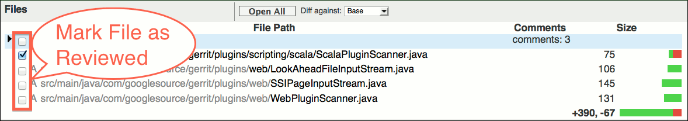

文件的前方字符会标识文件的修改类型：

 * `M` 或 '空白' (修改)

 * `A` (新增)

 * `D` (删除)

 * `R` (重命名)

 * `C` (复制)

 * `U` (未修改)

 此标识值在两个 patch-set 比较的时候出现。

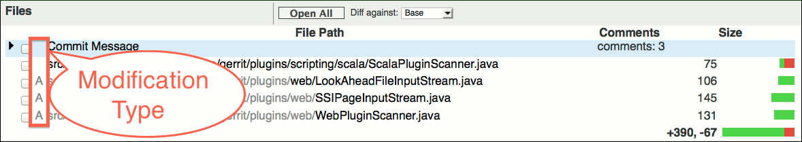

如果文件是重命名或者复制产生的，那么原始文件的名称会已灰色字体在下方显示出来。

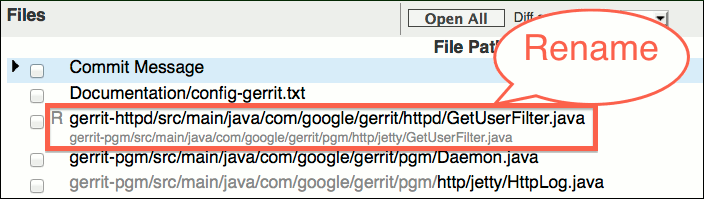

相同的路径会用灰色字体显示。

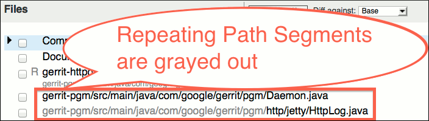

inline-comment 会在 `Comments` 栏显示。

draft-comments, 就是输入评论但评论还没有发布，会红色高亮显示。

其他评审人员的评论发布后，会以高亮加粗显示。

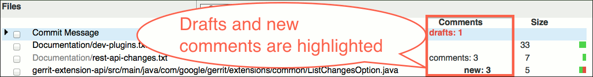

文件修改的行数会在 `Size` 栏显示。最下面显示修改的汇总。

文件修改的行数可以容易的看出文件的修改情况，根据修改量还可以预估一些评审的时长。

文件的修改行数可以用数字显示，也可以用色彩条表示，用户可以自行设置，修改行数包括新增行数和删除行数。如果用色彩条表示的话，绿色表示新增，红色表示删除。

二进制文件不显示文件的修改量。

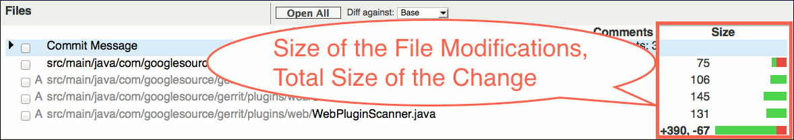

在文件列表顶部，`Diff Against` 可以从下拉菜单中选择，选择变更后，文件列表也会变化。

文件列表顶部提供了 `Open All` 按钮，点击按钮可以查看所有修改文件的差异。

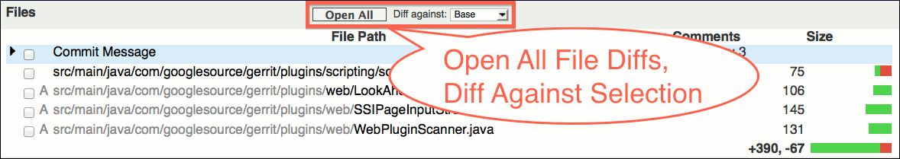

### Patch Sets

change 页面每次只能显示一个 patch-set。patch-set 可以从 `Patch Sets` 下拉菜单中进行选择。此菜单会显示当前 patch-set 号和总共的 patch-set 数量。格式为：`当前 patch-set 号 / 总共的 patch-set 数量`。

`non-current` patch-set 表明不是 change 的最新状态，一些操作只能在最新的状态上进行。

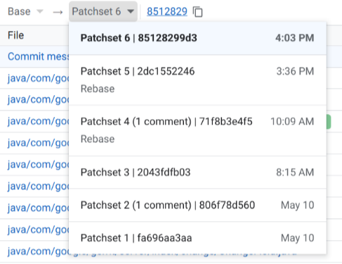

`non-current` 也会通过高亮下拉菜单方式显示。

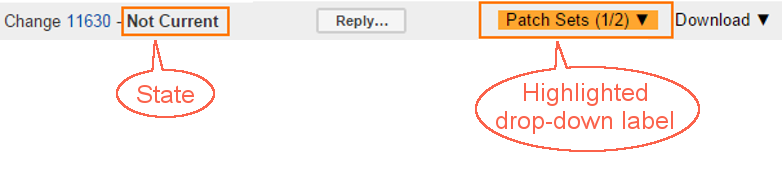

`Patch Sets` 下拉菜单中的内容按降序方式排列，因此最新的 patch-set 会在列表最上方显示。

Draft patch sets 会标识为 `DRAFT`.

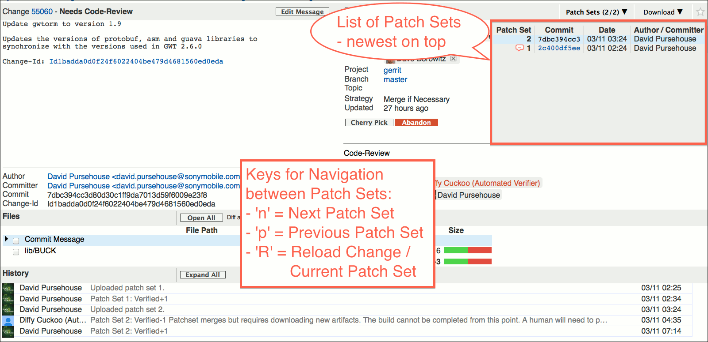

### Download

`Download` 下拉菜单在页面的右上方，提供了当前显示的 patch-set 的下载命令。

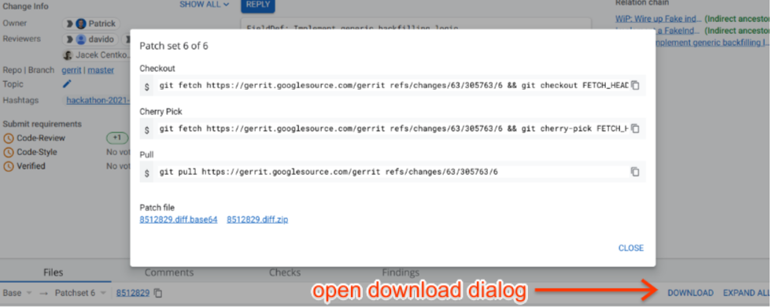

安装 plugin:[download-commands](https://gerrit-review.googlesource.com/admin/repos/plugins/download-commands) 才会显示下载命令，命令包括： checkout, pull 和 cherry-pick。

每个命令的后面都有一个图标，点击后可以将命令复制下来，这样方便在命令行上使用。

如果服务器上配置了多种下载方式，如： SSH 和 HTTP，那么会有一个下拉菜单来选择下载的方式。Gerrit 会自动保存最后一次的下载方式，再次打开页面时，会显示上次的下载方式。

`Patch-File` 提供了 patch 文件的下载，下载方式有 base64 encoded 和 zipped 两种格式。

`Archive` 可以打包下载 patch-set 所涉及的修改文件，有两种格式：tar 和 tbz2，格式可以在服务器端进行配置。

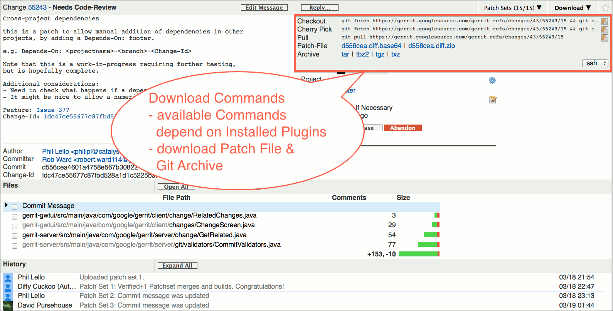

### Included In

对于已经 merged 状态的 changes，页面右上方会有 `Included In` 下拉菜单。

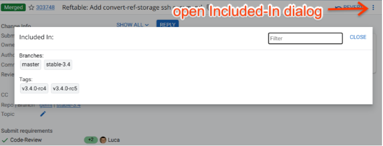

`Included In` 下拉菜单显示了 change 所在的分支和 tags 的信息。例如，change 修复了一个问题，这个功能可以方便的看到哪些分支或者 tags 修复了这个问题。

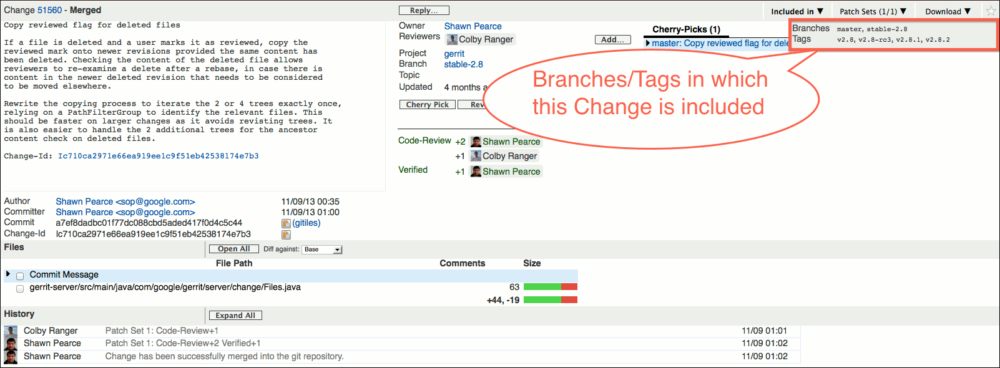

### Star Change

change 页面顶部的星星图标可以用来对 change 标识关注。再次点击图标，取消关注。

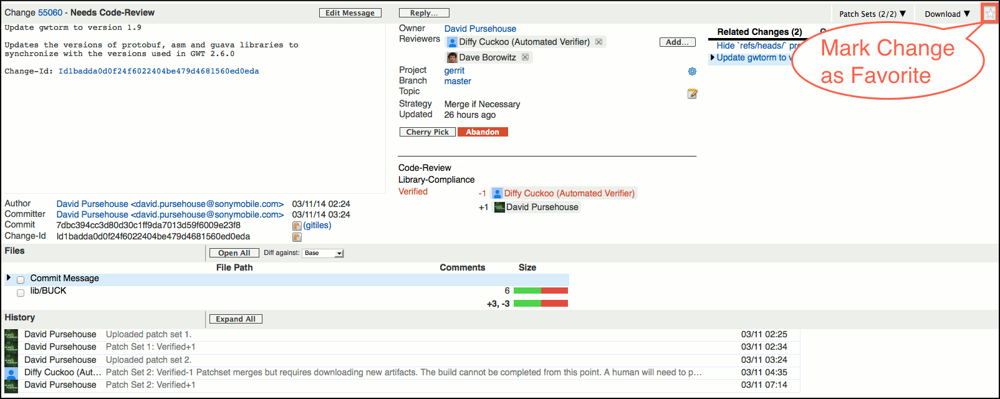

关注 change 后，系统会对 change 的变化发出邮件提醒。

已关注的 change 会在列表中显示，页面点击 `My` > `Starred Changes`.

### Related Changes

如果一些 change 和当前的 change 相关联，那么会在页面的右上方显示。

标签页会分页显示有关联的 change 。

下面为显示的标签页:

 * `Related Changes`:

 此标签页显示了和当前 change 有依赖关系的 change。
 
此处 change 的排列方式类似 'git log' 的输出方式。这样可以从列表中容易的看出 change 之前的关系。列表中，祖先节点在下方。

 对于 merged 状态的 change，标签页只显示 open 状态的子孙节点。

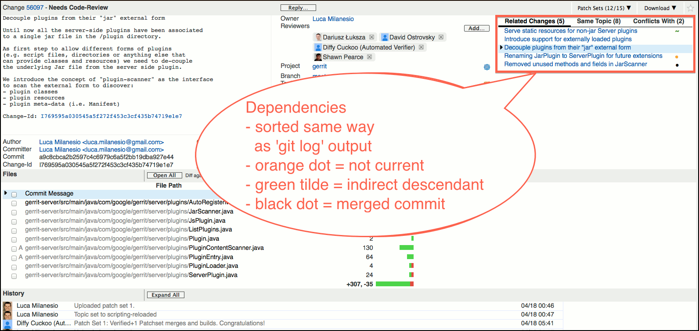

 列表中的 change 前面有肯能会有图标进行标识，图标说明如下：

    橙色圆点:

 表示不是最新的 patch-set。

 如果祖先节点标识了橙色圆点，意味着当前的 patch-set 依赖着非最新状态的祖先节点，有可能是祖先节点更新了 patch-set 导致的，当前的 patch-set 可以选择 rebase 操作。

 如果子孙节点标识了橙色圆点，意味着子孙节点的非最新 patch-set 依赖当前的 patch-set，子孙节点可以执行 rebase 操作，操作后，依赖关系会被移除。

    绿色波浪线:

 表示被标识的 change 的 patch-set 是当前 patch-set 的间接子孙节点，与当前 change 的其他 patch-set 有依赖关系。比如，当前的 change 有了新的 patch-set，子孙节点需要进行 rebase 操作。点击间接子孙节点后，显示的相关联 change 列表有可能会改变。

    黑色圆点:

 表示祖先节点已经合入代码库了，如：commit 没有经过评审直接被 push 到了代码库；或者祖先节点合入到了其他的分支，如：commit 在分支 `branch-a` 上面，结果错误的推向了分支 `refs/for/branch-b`。黑色圆点也可以表示 change 被 abondan 了。

    删除线:

 如果 commit 被 abandon, 那么文字会用删除线标识。

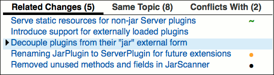

 * `Conflicts With`:

 此标签页列出了与当前 change 有冲突的 change。不具体合入条件的 change 被过滤掉了，只有冲突的并且具备合入条件的 change 才会显示。

 如果当前的 change 合入代码库了，那么冲突的 change 需要在本地基于最新的代码手动解决冲突。

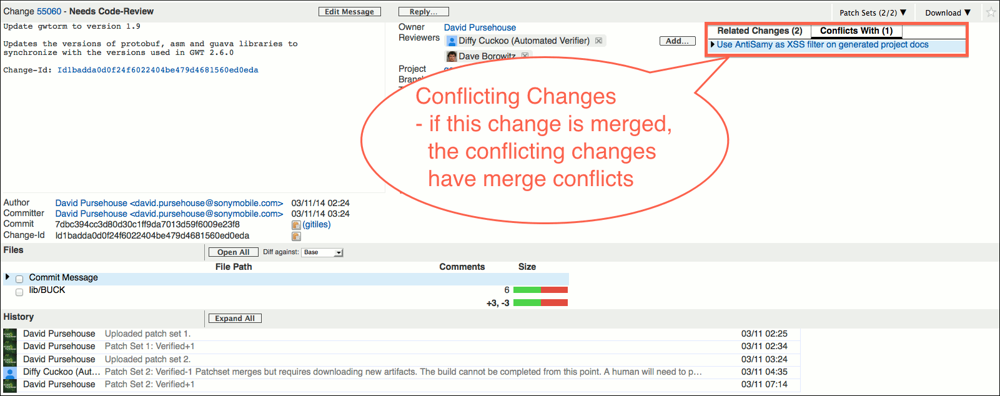

 * `Same Topic`:

 此标签页显示了和当前 change 具有相同 topic 的 change，只有 open 状态的 change 才会显示。

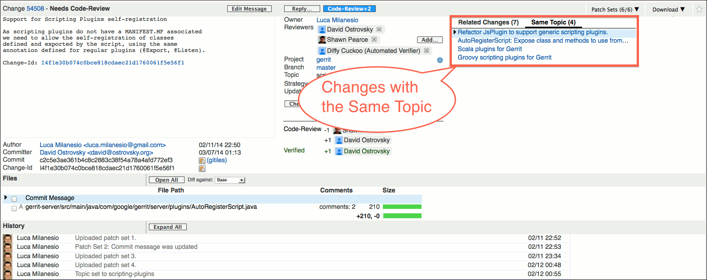

 * `Submitted Together`:

 此标签页显示了可以和当前 change 一起合入代码库的 change，列表中包括了当前 patch-set 的祖先节点。

 如果 `change.submitWholeTopic` 功能启动，那么列表中会显示相同 topic 并且是 open 状态的祖先节点。

 * `Cherry-Picks`:

 标签页列出了当前 project 中相同 [changeid](user-changeid.md) 的 change。

 abandon 的 change 不显示。

 所要合入的目的分支名称会在 change 描述的前面显示。

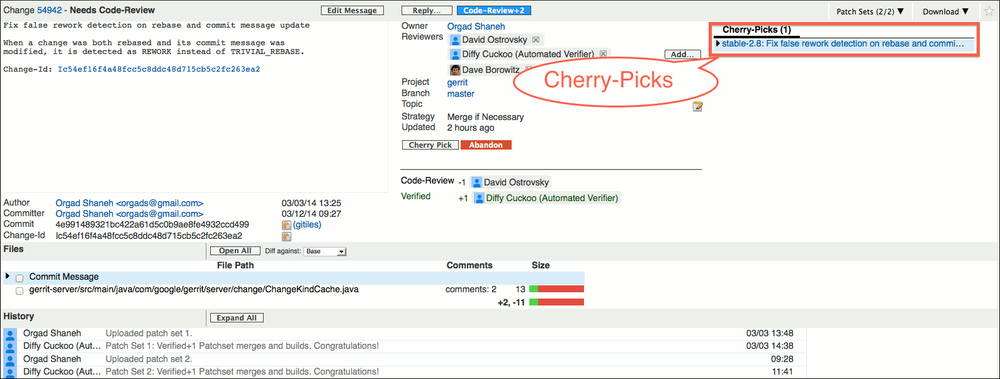

如果没有相关联的 change，那么此类标签页不显示。

### Reply

change 页面上方的 `Reply...` 按钮用来打分和评论。

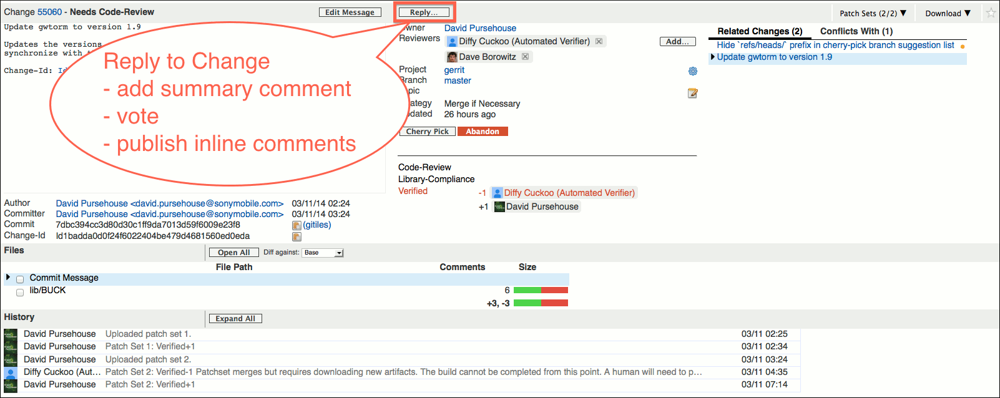

点击 `Reply...` 按钮会弹出一个窗口。

文本框可以输入评审信息，支持基本的 mardown 语法，如：行开头 "- " 或 "* " 表示列表，行开头 "> " 标识块引用等。

按钮的文字显示及提示信息可以在服务器端配置，可以参考 [系统配置](config-gerrit.md) 的 replyLabel 部分。

代码检视过以后，可以通过单选按钮进行打分。只有最新的 patch-set 才能打分。

窗口下部会显示 inline-draft-comments 的信息，上面有链接，可以直接跳转相应的代码及评论处。

`Post` 按钮用于发布评论和打分。

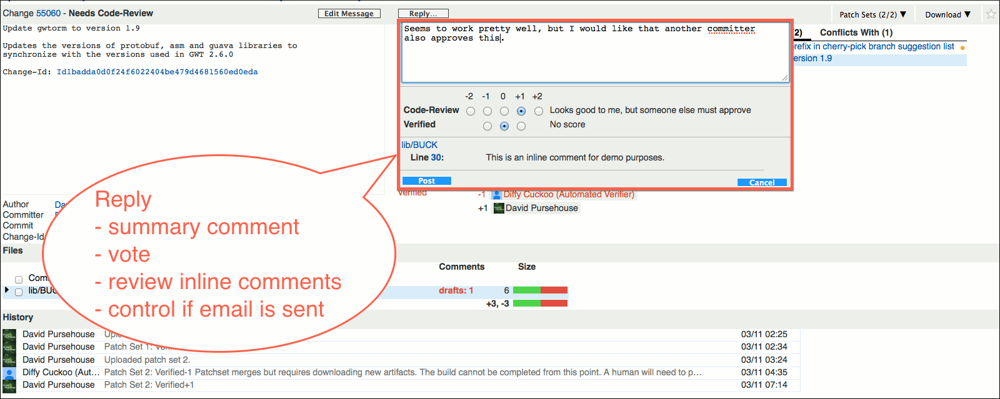

评审人员打分的时候没有打最高分，如果再次评审的时候，那么页面的上方(reply 按钮的后面)会有一个打最高分的快捷按钮。

例如，'Verified' 打了 '+1' vote, 这时需要给 'Code-Review' 打分，那么 `Code-Review+2` 按钮会出现。

如果评论栏里面写了评论，点击快捷按钮的话，评论也会发布出去。

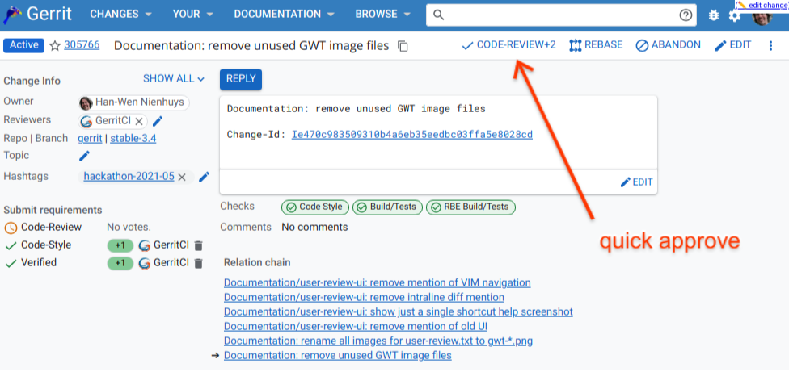

### History

change 页面的下方可以看到评审的历史记录。

历史记录包含了 change 很多的信息，如：patch-set 是何时生成的，评审人员什么时间评审的。

其他评审人员的最新评审信息会自动加载到当前评审人员的页面。

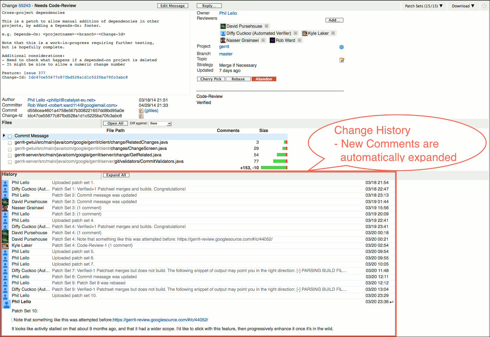

点击行尾的回车图标可以对评论直接回复。点击后，会弹出一个窗口，之前的评论会以 "> " 开头，新的回复和原来的评论要有一个空行。

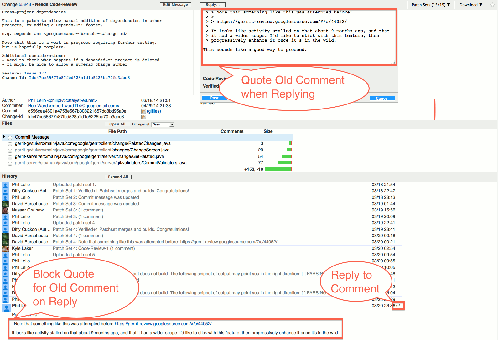

inline-comment 会在 change 的历史记录中显示，点击链接会跳转到对应的评论处。

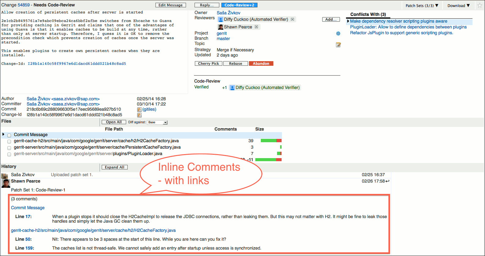

`Expand All` 按钮可以展开信息，`Collapse All` 按钮可以折叠信息。

### Update Notification

系统会自动对 change 页面的更新做轮寻操作，一旦有更新，页面的右下方会有提示。

轮寻的默认频率是 30s，可以在服务器端配置，轮寻也可以取消。

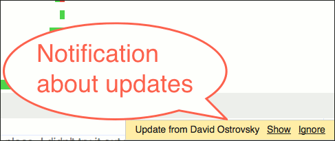

### Plugin Extensions

Gerrit 的 plugin 可以扩展 change 页面，比如：添加功能按钮或者显示一些信息。

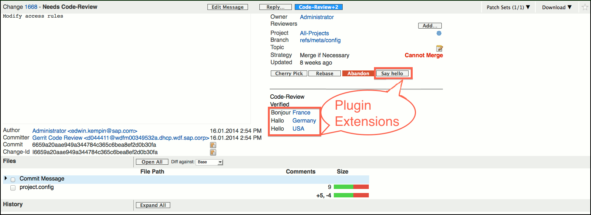

## Side-by-Side Diff Screen

side-by-side diff 页面中，文件的老的版本在左侧显示，新版本在右侧显示。

页面中可以进行评审并添加评论。

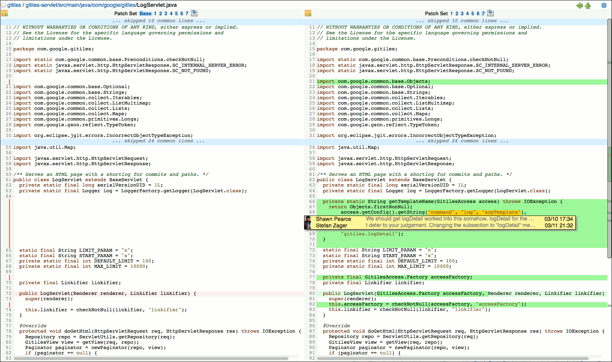

页面的上方会显示 project 名字和待评审文件的名字。

如果服务器集成了 git-web ，点击 ` project 名字和待评审文件的名字` 的链接后，git-web 会显示相关的目录。

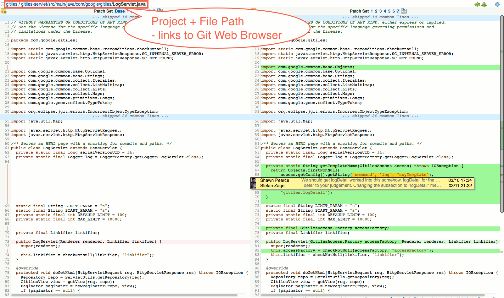

待评审文件的前方，有个复选框，可以用来标记是否评审。如果对文件进行了检视，系统会自动进行标记为已评审。

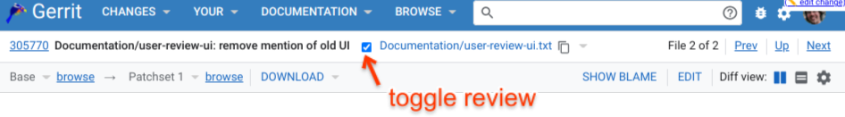

移动滚动条，可以看到文件的差异和评论。点击评论可以快速的跳转到对应的代码行。

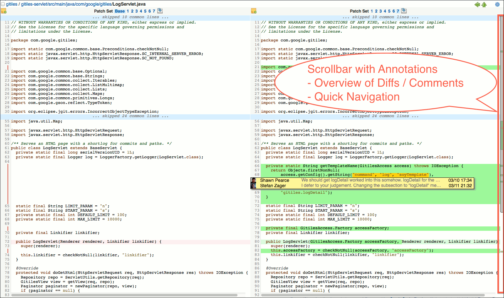

文件中，行之间的间隙是由于左右两侧需要对齐导致的。用红色的竖直的条表示，这样可以避免误认为是文件中真实的空隙。

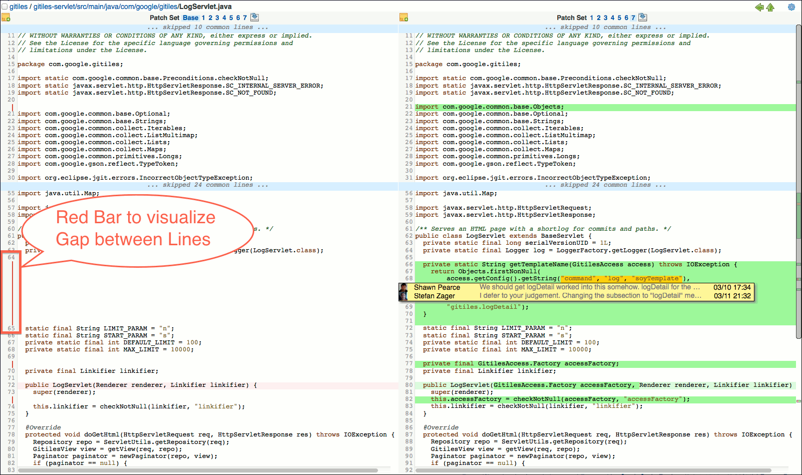

页面的上方，两侧会显示 patch-set 的列表，点击 patch-set 后，两侧会重新显示比较结果，当前选中的 patch-set 会以蓝色背景高亮显示。

左侧可以作为 patch-set 比较的基础，右侧来查看差异。

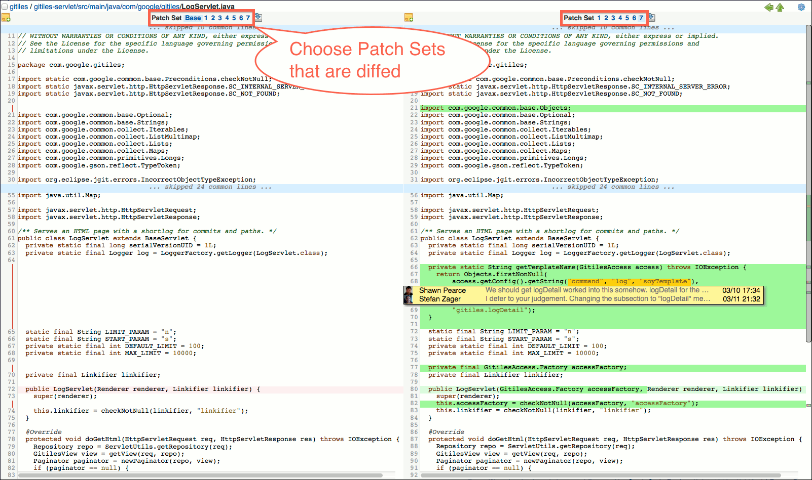

点击 patch-set 附近的下载图标可以下载 patch。The download icon next to the patch set list allows to download the
patch. 如果文件的 mime 配置为 safe，那么下载下来的是文件，否则下载下来的是压缩包。

如果两侧的文件相同，那么在页面的右上方会有红色高亮字体 `No Differences` 显示。

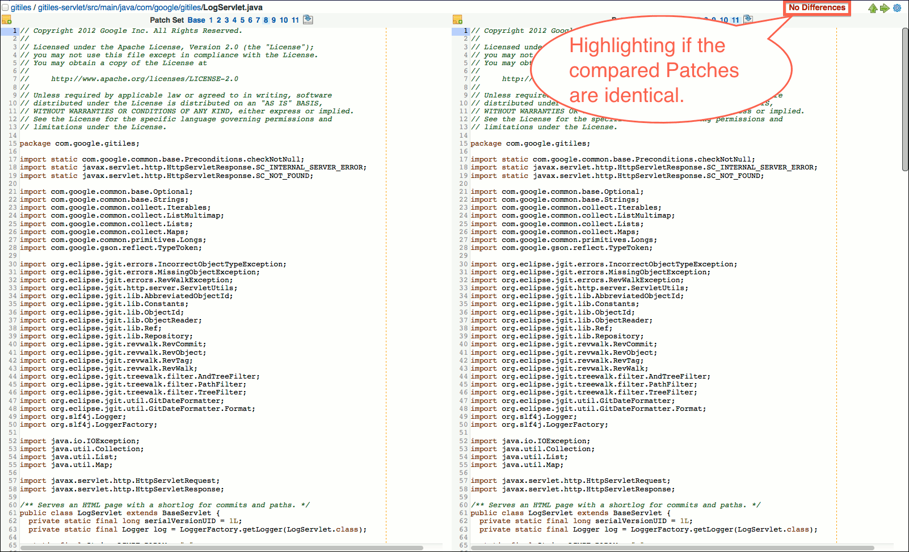

如果文件重命名了，新老文件的名字会在页面上面一起显示出来。

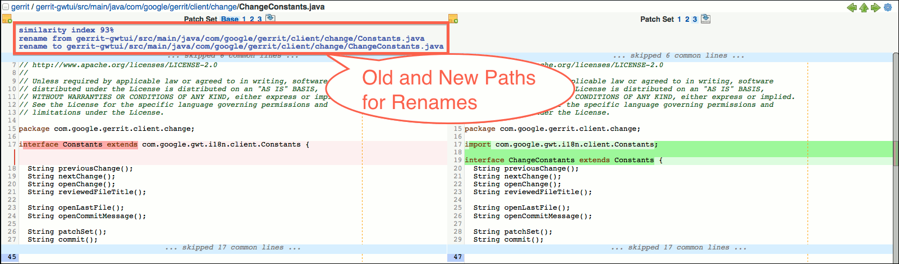

页面右上方有导航按钮。向左箭头按钮会跳转到上一个 patch，向右的按钮会跳转到下一个 patch，向上的按钮会返回到 change 页面。跳转过程中，两侧选择的 patch-set 是保持不变的。

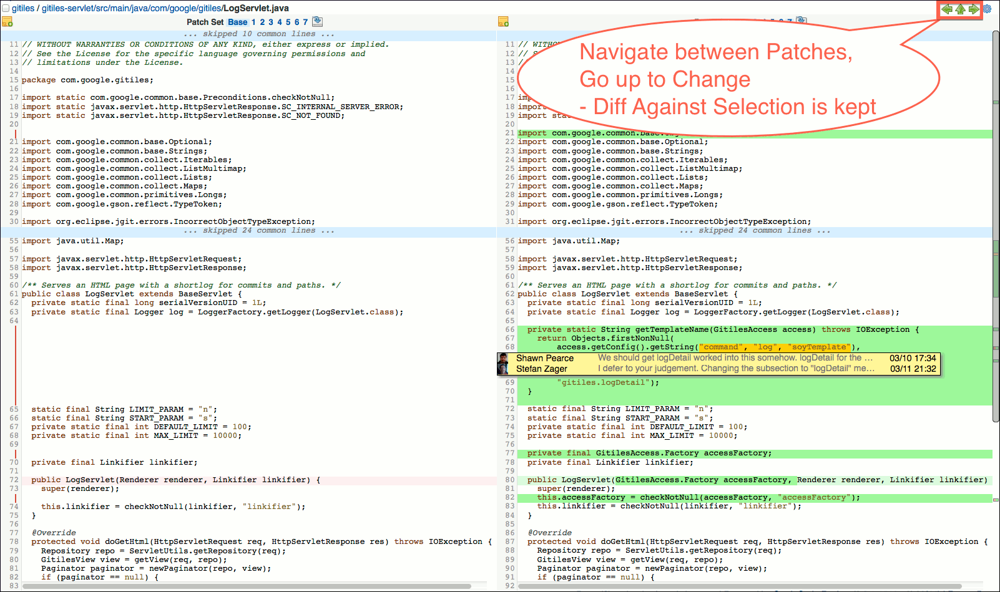

### Inline Comments

inline-comment 直接在 patch-file 中的代码行下面显示。可以对代码行或者代码块进行 inline-comment。

如果 inline-comment 对应的是代码块，那么代码块以黄色背景高亮显示。

如果代码中有多个 inline-comment，那么代码块与 inline-comment 有可能会重叠。

patch-file 的代码行是可以添加链接的。需要在文件链接后面添加 '@<line-number>' ，如： `http://host:8080/#/c/56857/2/Documentation/user-review-ui.txt@665`。如果要在文件的老版本中添加链接，需要添加 '@a<line-number>' 。点击链接可以直接跳转到代码的具体位置。

`Expand All Comments` 设置为 `Expand`, 那么所有的 inline-comment 会自动展开。

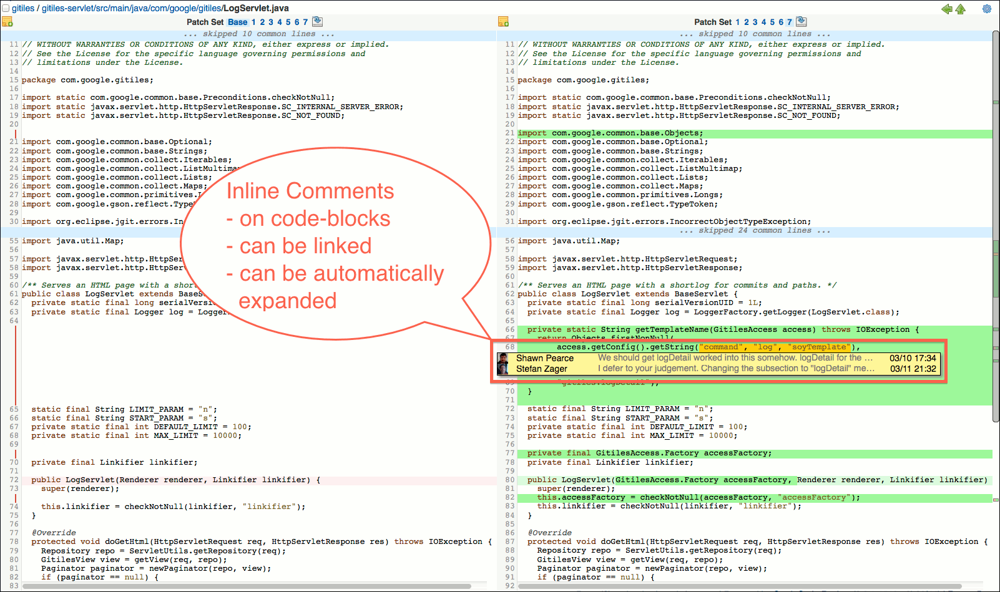

在评论窗口的顶部，会显示评论的作者会时间，如果服务器集成了 avatars，那么还会显示作者的头像。

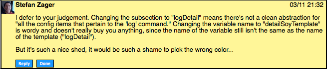

点击 `Reply` 按钮可以输入回复信息。

回复时，支持引用。不过需要手动把之前的信息复制粘贴过来，并在每行的行首添加 "> "。引用和新的回复之间，要有一个空行。

点击 `Save` 按钮，可以将评论保存，发布后，其他人才会看到评论。

`Cancel` 按钮用来取消编辑。

`Discard` 按钮用来删除 draft 状态的评论。

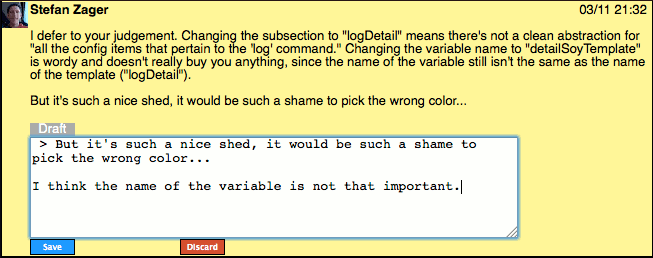

draft-comment 在评论窗口的顶部会有 "Draft" 标识。

点击 `Edit` 按钮会对 draft-comment 进行编辑，点击 `Discard` 按钮，会进行删除。

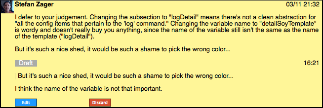

点击 `Done` 按钮，可以用 "Done" 完成回复。这个是用来对 follow-up 的 patch-set 标识为完成。

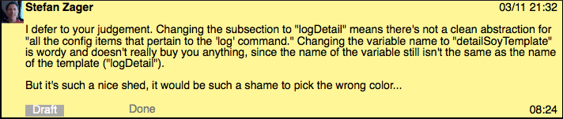

添加 inline-comment 方法如下：

 * 选择代码块后，按 'c'
 * 选择代码块后，再点击弹出的评论图标
 * 光标移动到代码行后，进行点击，或者按 'c'
 * 点击行号

选中代码进行评论的方法如下：

 * 使用鼠标:
    点击并且拖拽，选中代码块
    选中字符串后，进行双击
    选中代码块后，进行双击
    对行进行三击
    选中代码块后，进行三击

 * 使用键盘 (参考 Vim):
    按 'v' + 方向键 (or 'h', 'j', 'k', 'l') 选择代码块
    按 'V' + 方向键 (or 'j', 'k') 选择代码块
    输入 'bvw' 选择字符串

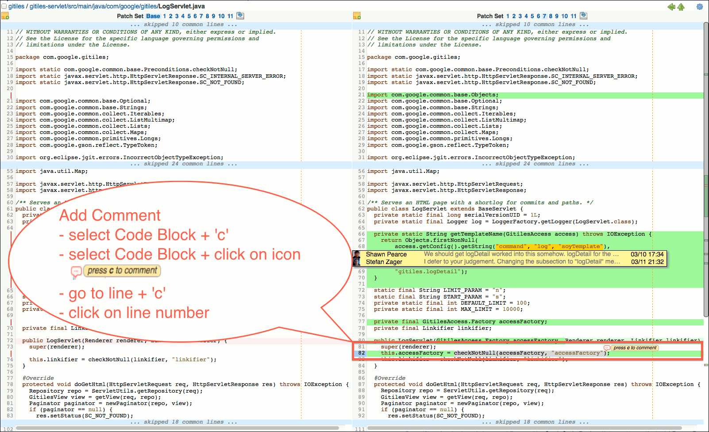

输入评论后，新的评论会在代码的下方显示。

点击 `Save` 按钮，保存评论，评论发布后，其他用户才可以看到。

点击 `Discard` 按钮会删除新的评论。

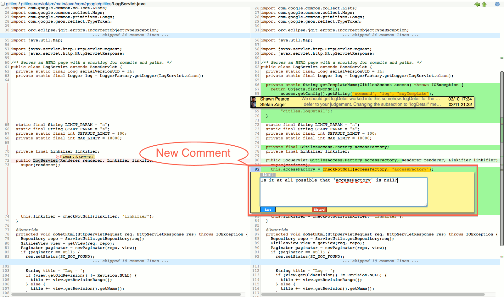

### File Level Comments

可以对整个文件添加评论。

点击文件上方的评论图标即可对文件添加评论。

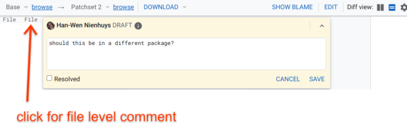

点击图标后会弹出输入框，然后可以填写评论。

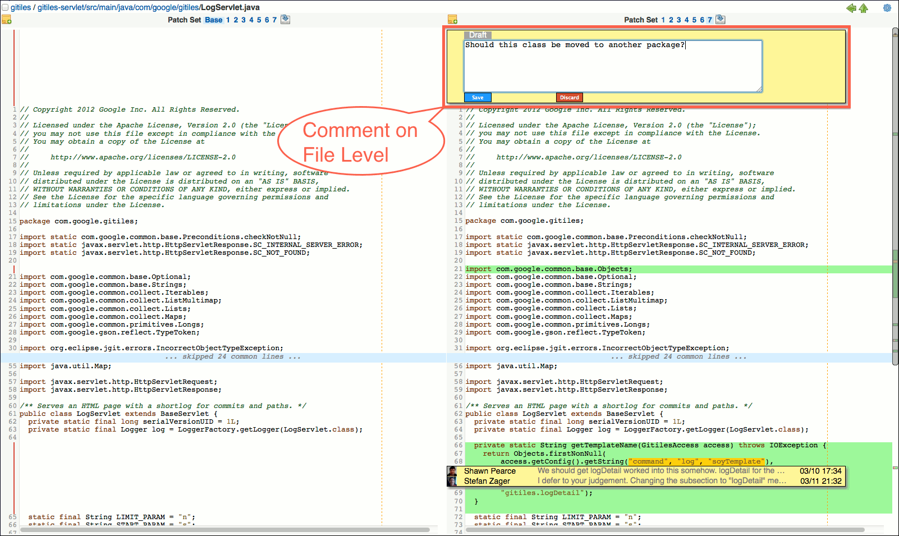

### Search

评审文件时，在文件中可以使用搜索功能，方式类似 vim 的命令行操作。输入 `/` 会弹出搜索栏，输入搜索字符后，文件中匹配到的字符会高亮黄色背景显示。搜索框中，支持 JavaScript 正则表达式，大小写敏感。条件输入后，键盘点击回车按钮， `n` / `N` 可使光标在搜索结果中向前或向后移动，光标跳转到搜索结果时，如果有隐藏的代码行，这些代码行会自动显示出来。

更多操作可参考 [Vim documentation](http://www.vim.org/docs.php) 。还有一个有用的方法，当光标选中词语后，按 `*` 或 `#` 可以向前或向后进行搜索。

如果 `Render diff preference` 没有设置成 `Slow` ，那么 `Ctrl-F` 将会在当前屏幕中进行搜索。

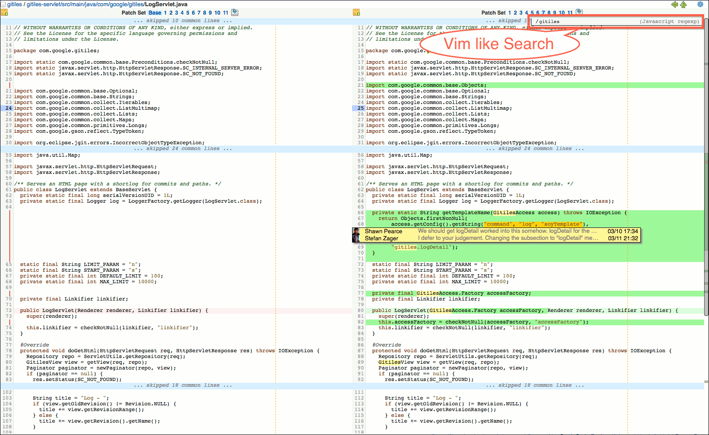

### Key Navigation

评审文件时，可以使用类似 Vim 的命令在文件上跳转：

 * `h` / `j` / `k` / `l` 移动光标 左 / 下 / 上 / 右
 * `0` / `$` 移动光标 行首 / 行尾
 * `gg` / `G` 移动光标 文件开始 / 文件结尾
 * `Ctrl-D` / `Ctrl-U` 滚动 向下 / 向上

更多操作可参考 [Vim documentation](http://www.vim.org/docs.php) 。

### Diff Preferences

有一些参数可以控制 patch 差异的显示，用户可以点击设置按钮自行配置。

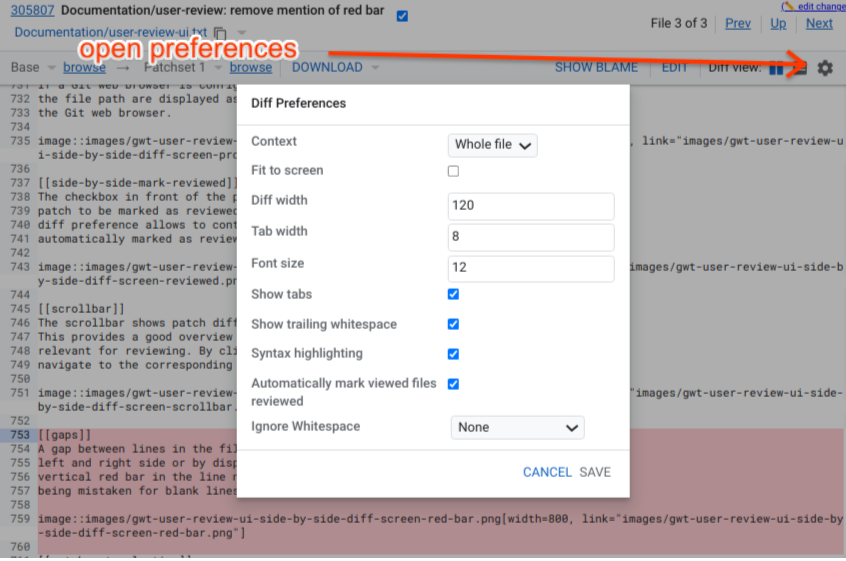

在弹出的配置窗口中，点击 `Save` 按钮可以永久保存设置；点击 `Apply` 按钮，只在当前页面生效，页面刷新后，配置失效。`Save` 按钮在用户登录后才会显示出来。

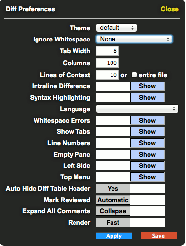

配置说明:

 * `Theme`:

 选择主题类型

 可以选择灰色主题

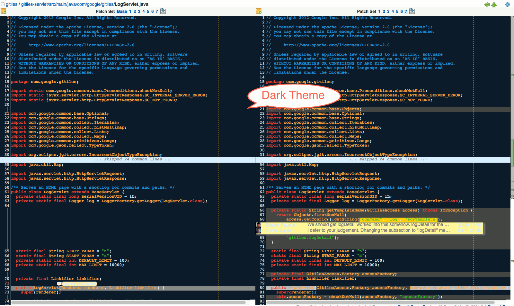

 * `Ignore Whitespace`:

 是否忽略空白

    `None`:

 空格高亮显示

    `At Line End`:

 忽略结尾空格

    `Leading, At Line End`:

 忽略行首空格

    `All`:

 忽略所有空格

 * `Tab Width`:

 tab 对应空格的数量

 * `Columns`:

 设置垂直参考线的的位置

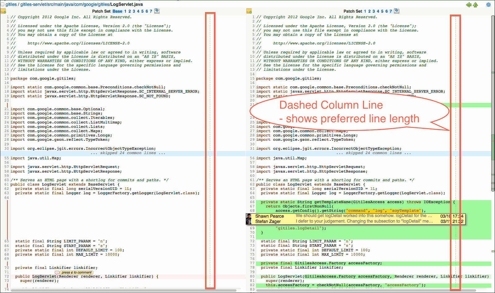

 * `Lines Of Context`:

 显示差异部分上下行的行数。如果勾选 `entire file` ，那么文件的所有内容会显示出来。

 点击 `... skipped <n> common lines ...` 后，折叠的行会显示出来。

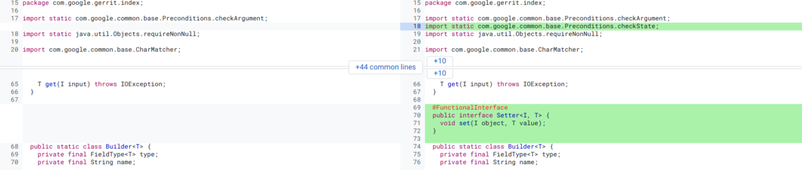

 * `Intraline Difference`:

 差异是否高亮显示

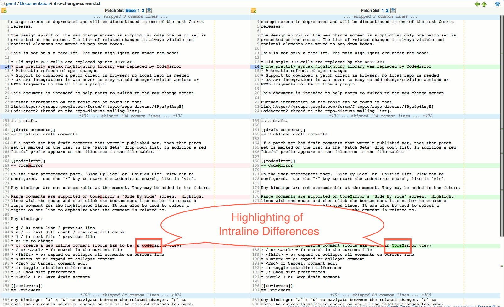

 * `Syntax Highlighting`:

 是否启用语法高亮

 `Language` 下拉菜单选择语言后，会根据选择的语言进行语法高亮显示。

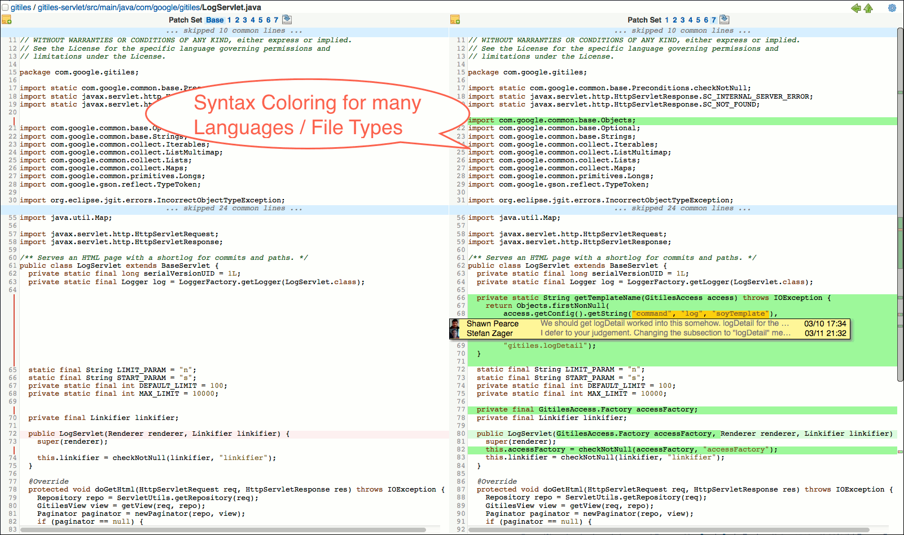

 * `Whitespace Errors`:

 空白错误是否高亮

 * `Show Tabs`:

 tab 是否高亮

 * `Line Numbers`:

 是否显示行号

 * `Empty Pane`:

 是否置空。新增文件，左侧置空；删除文件，右侧置空。

 * `Left Side`:

 左侧比较是否显示。打开 diff 页面时，系统会自动设置为 `Show`。

 * `Top Menu`:

 是否显示顶层菜单

 * `Auto Hide Diff Table Header`:

 页面滚动超过半页时，是否隐藏表头

 * `Mark Reviewed`:

 检视后的文件是否自动标识为已评审

 * `Expand All Comments`:

 是否自动展开所有评论

 * `Render`:

 用于设置加载文件内容的多数。

 `Fast`，加载快，`Ctrl+F` 只能对显示区域的内容进行搜索。

 `Slow`，加载慢，`Ctrl+F` 可以对整个文件搜索。

 文件超过 4000 行，将不能完全加载。

 * `Line Wrapping`:

 是否启用换行

 `false`，取消换行，默认配置

 `true` ，启用换行

## Keyboard Shortcuts

review UI 页面的跳转及一些操作可以使用快捷键来完成。输入 `?` 会弹出快捷键的说明。

 * Change Screen

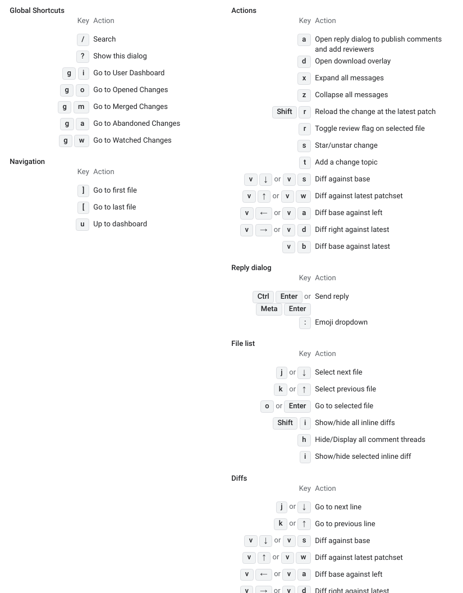

 * Side-by-Side Diff Screen

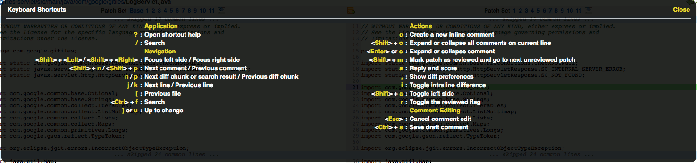

 另外，评审修改的文件时，可以使用类似 vim 的命令进行字符串搜索。

## 新 Review UI vs. 老 Review UI

新老 Review UI 有着概念上的差异：

 * 老页面可以直接显示出 change 所有的 patch-set；新页面只能显示一个 patch-set。

 * 老页面，用户在文件的行上双击即可添加评论；新页面上的双击只会选中一个词语，不过可以先选中代码块然后点击评论图标进行评论。

新 review UI 的限制:

 * 新 side-by-side diff 页面不能加载图片

 * 新 side-by-side diff 页面的结尾不能高亮显示

