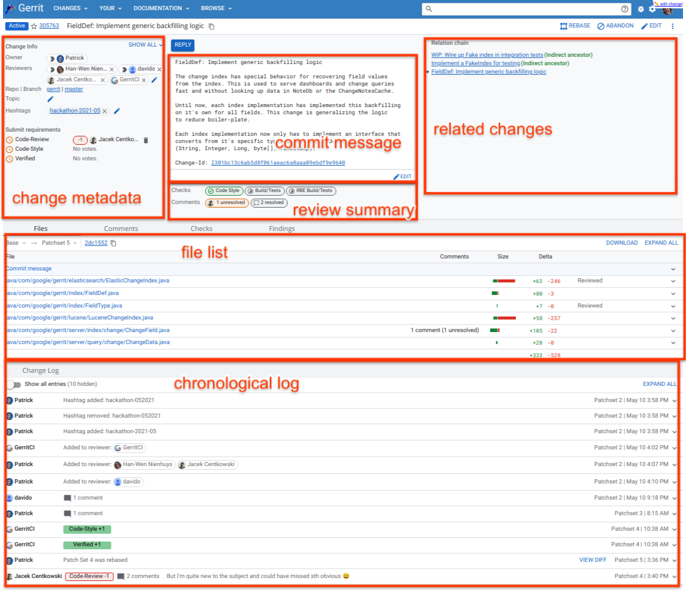
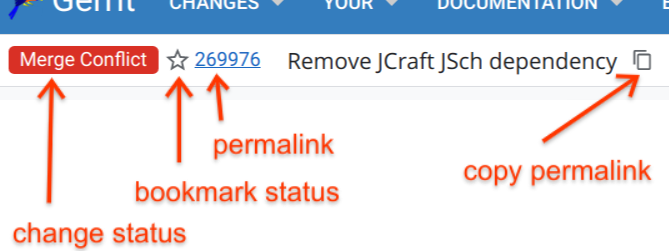

# Review UI

评审 changes 是一项重要的任务，Gerrit　的页面提供了很多与评审相关的功能，使评审更加便捷．此文主要介绍 Gerrit 的 review-UI 一些功能.

review-UI 主要分为三个部分： 
* dashboard, 显示用户相关的 change
* change screen, 显示 change 的 metadata
* diff view, 显示文件的修改信息

## Change Screen

change-screen 显示了 change 的一些细节，并提供了一些功能按钮．

下面是 screen 的主要区域。

### Top info

顶端的左面，有 change 状态的显示。

 
change-status 显示了 change 当前所处的状态:
 
 * `Active`:

change 在评审中。
 
 * `Merge Conflict`:

如果有冲突，change 不能合入。

 * `Ready to Submit`:

　change 的各个评审项已通过，待点击 submit 按钮合入

 * `Merged`:

　change 已经合入了代码库

 * `Abandoned`:

　change 被 abandon

### Star Change

点击 star 图标可以关注 change，系统并开启此 change 的邮件提醒。用户可以通过 `Your` > `Starred Changes` 查询关注的 change。

### Change metadata
 
`change metadata` 区域包含了 change 的相关信息。
 
 * Reviewers:

 显示 change 评审人员列表．

 鼠标移动到评审人员上，会有允许打分项的提示．

 点击 pencil 图标可以添加新的评审人员. 在弹出的文本框中输入用户和群组名称的时候，系统会自动补齐．

 点击 `x` 图标，可以将评审人员从列表中移除．移除评审人员后，评审人员的打分也会相应被移除．change 的 message 中会记录被移除的打分信息．

 移除评审人员是受权限控制的:

    * 用户可以移除自己
    * change-owner 可以移除 0 和正分
    * 有权限的用户，, the branch-owner, project-owner 和管理员可以移除任何一个评审人员

 * Project / Branch / Topic:

　点击 change 页面中 project 的内容，会跳转到这个 project 的 open 状态下的 change 的视图．

　点击 branch 名称，会跳转到这个 branch 当前 change 状态的 change 列表的页面．

　topic 在 branch 的下面显示．点击后面的编辑按钮，可以编辑 topic 的信息，不过这个权限是受控的．如果要在关闭状态的 change 上编辑 topic，要勾上 `Edit Topic Name` 权限的 `force` 标识．

 * Submit Strategy:

　submit-strategy 用来显示 change 合入时的方式，并且只有 open　状态的 change 才会显示．

 * Actions:

  Actions 按钮在 `overflow` 菜单的顶部.

　change 的操作依赖于 change 的状态及用户权限，否则一些执行操作的按钮是不可见的。

　* `Submit`:

　将 change 添加到合入的队列中，然后将其合入到目的代码分支上。

　`Submit` 按钮只有在评审条件都通过并且有此权限的情况下才可见。

    * `Revert`:

　通过创建新 change 的方式来 revert change。

　`Revert` 按钮只有 change 已经合入的状态下才可见。

　当点击 `Revert` 按钮后，会弹出一个窗口，用来输入原因。

　一旦 revert change 被创建，原 change 的作者和评审人员会自动作为评审人员添加到新 change 的评审人员列表中。

    * `Abandon`:

　abandons change.

　`Abandon` 按钮受权限控制，并且只有 change 是 open 状态下才可见。

　当 change 被 abandon 的时候，会弹出一个窗口，用来输入原因。

    * `Restore`:

　Restores the change.

　`Restore` 按钮受权限控制并且只有 change 在 abondan 状态下才可见。

　change 被 restor 时，会弹出窗口，用来填写原因。

    * `Rebase`:

　rebases change。rebase 需要启用 content-merge 功能后才可以使用。如果 rebase 失败，那么需要在本地手动解决冲突。

　如果 change 不依赖其他 open 状态下的 change, 那么 commit 会 rebase 到目的分支的顶端。

　如果 change 依赖其他 open 状态下的 change, 那么 commit 会 rebase 到所依赖的 change 上。

　rebase 后，change 的父节点有可能会改变。比如基于最新代码生成的两个 change ，A 和 B，当 A 合入后，再合入 B ，那么 B 的父节点就变成了 A。

　`Rebase` 按钮受权限控制。merge 节点不支持 rebase 操作。

    * `Cherry-Pick`:

　将 change cherry-pick 到其他的分支。可在弹出的窗口中选择目的分支。cherry-pick 会在目的分支生成一个新的 change。

　cherry-pick 的目的分支有可能与原分支相同，此情况下，可以移除 change 间的依赖关系。

　cherry-pick 的权限同上传/生成 change 的权限。

    * `Delete Change` / `Delete Revision`:

　delete change.

　对于 open 或者 abandoned 状态的 change, 如果有权限的话，可以进行删除。

    * 插件还可以提供其他的操作。

 * Labels & Votes:

　打分时，显示绿色为通过，红色为不通过。

### File List

patch-set 中所修改的文件列表。

另外，文件列表中还包含了一种文件：magic-files，此文件虽然是 Gerrit 产生的，但并不存在在 git 仓中。magic-files 包含了一些 commit 的数据，这些数据是可以进行评审的。magic-files 总会出现在文件列表的首位。下面是 magic-files 的类型说明：

 * `Commit Message`:

 commit-message 包含父节点，作者，提交者等信息。

 * `Merge List` (merge 节点才有):

 显示父节点的相关信息。

### Patch Sets

change 页面每次只能显示一个 patch-set。patch-set 可以从 `Patch Sets` 下拉菜单中进行选择。

### Download

`Download` 下拉菜单在页面的右上方，提供了当前显示的 patch-set 的下载命令。

安装 plugin:[download-commands](https://gerrit-review.googlesource.com/admin/repos/plugins/download-commands) 才会显示下载命令，命令包括： checkout, pull 和 cherry-pick。

每个命令的后面都有一个图标，点击后可以将命令复制下来，这样方便在命令行上使用。

如果服务器上配置了多种下载方式，如： SSH 和 HTTP，那么会有一个下拉菜单来选择下载的方式。Gerrit 会自动保存最后一次的下载方式，再次打开页面时，会显示上次的下载方式。

`Patch-File` 提供了 patch 文件的下载，下载方式有 base64 encoded 和 zipped 两种格式。

`Archive` 可以打包下载 patch-set 所涉及的修改文件，有两种格式：tar 和 tbz2，格式可以在服务器端进行配置。

### Included In

对于 `merged changes` 来说，`Included In` 表明此 change 在哪些 branch 或 tag 中。

### Related Changes

如果一些 change 和当前的 change 相关联，那么会在页面的右上方显示。

标签页会分页显示有关联的 change 。

下面为显示的标签页:

 * `Related Changes`:

 此标签页显示了和当前 change 有依赖关系的 change。
 
此处 change 的排列方式类似 'git log' 的输出方式。这样可以从列表中容易的看出 change 之前的关系。列表中，祖先节点在下方。

 对于 merged 状态的 change，标签页只显示 open 状态的子孙节点。

 列表中的 change 会有相关注释，如下：

    Not current:

 表示不是最新的 patch-set。

 表示当前的 patch-set 依赖着非最新状态的祖先节点，有可能是祖先节点更新了 patch-set 导致的，当前的 patch-set 可以选择 rebase 操作。

 如果子孙节点标识了 "not current"，意味着子孙节点的非最新 patch-set 依赖当前的 patch-set，子孙节点可以执行 rebase 操作，操作后，依赖关系会被移除。

    Indirect descendant:

 表示被标识的 change 的 patch-set 是当前 patch-set 的间接子孙节点，与当前 change 的其他 patch-set 有依赖关系。比如，当前的 change 有了新的 patch-set，子孙节点需要进行 rebase 操作。点击间接子孙节点后，显示的相关联 change 列表有可能会改变。

    Closed ancestor:

 表示祖先节点已经合入代码库了，如：commit 没有经过评审直接被 push 到了代码库；或者祖先节点合入到了其他的分支，如：commit 在分支 `branch-a` 上面，结果错误的推向了分支 `refs/for/branch-b`。黑色圆点也可以表示 change 被 abondan 了。

    Abandoned:
  
 表示 abondaned 的 change。

 * `Conflicts With`:

 此标签页列出了与当前 change 有冲突的 change。不具体合入条件的 change 被过滤掉了，只有冲突的并且具备合入条件的 change 才会显示。

 如果当前的 change 合入代码库了，那么冲突的 change 需要在本地基于最新的代码手动解决冲突。

 * `Submitted Together`:

 此标签页显示了可以和当前 change 一起合入代码库的 change，列表中包括了当前 patch-set 的祖先节点。

 如果 `change.submitWholeTopic` 功能启动，那么列表中会显示相同 topic 并且是 open 状态的祖先节点。

 * `Cherry-Picks`:

 标签页列出了当前 project 中相同 [changeid](user-changeid.md) 的 change。

 abandon 的 change 不显示。

 所要合入的目的分支名称会在 change 描述的前面显示。

如果没有相关联的 change，那么此类标签页不显示。

### Reply

change 页面上方的 `Reply...` 按钮用来打分和评论。

点击 `Reply...` 按钮会弹出一个窗口。

文本框可以输入评审信息，支持基本的 mardown 语法，如：行开头 "- " 或 "* " 表示列表，行开头 "> " 标识块引用等。

按钮的文字显示及提示信息可以在服务器端配置，可以参考 [系统配置](config-gerrit.md) 的 replyLabel 部分。

代码检视过以后，可以通过单选按钮进行打分。只有最新的 patch-set 才能打分。

窗口下部会显示 inline-draft-comments 的信息，上面有链接，可以直接跳转相应的代码及评论处。

`Post` 按钮用于发布评论和打分。

评审人员打分的时候没有打最高分，如果再次评审的时候，那么页面的上方(reply 按钮的后面)会有一个打最高分的快捷按钮。

例如，'Verified' 打了 '+1' vote, 这时需要给 'Code-Review' 打分，那么 `Code-Review+2` 按钮会出现。

如果评论栏里面写了评论，点击快捷按钮的话，评论也会发布出去。

### History

change 页面的下方可以看到评审的历史记录。

历史记录包含了 change 很多的信息，如：patch-set 是何时生成的，评审人员什么时间评审的。

其他评审人员的最新评审信息会自动加载到当前评审人员的页面。

点击行尾的回车图标可以对评论直接回复。点击后，会弹出一个窗口，之前的评论会以 "> " 开头，新的回复和原来的评论要有一个空行。

inline-comment 会在 change 的历史记录中显示，点击链接会跳转到对应的评论处。

`Expand All` 按钮可以展开信息，`Collapse All` 按钮可以折叠信息。

### Update Notification

系统会自动对 change 页面的更新做轮寻操作，一旦有更新，页面的右下方会有提示。

轮寻的默认频率是 30s，可以在服务器端配置，轮寻也可以取消。

### Plugin Extensions

Gerrit 的 plugin 可以扩展 change 页面，比如：添加功能按钮或者显示一些信息。

## Side-by-Side Diff Screen

side-by-side diff 页面中，文件的老的版本在左侧显示，新版本在右侧显示。

页面中可以进行评审并添加评论。

页面的上方会显示 project 名字和待评审文件的名字。

如果服务器集成了 git-web ，点击 ` project 名字和待评审文件的名字` 的链接后，git-web 会显示相关的目录。

待评审文件的前方，有个复选框，可以用来标记是否评审。如果对文件进行了检视，系统会自动进行标记为已评审。

页面的上方，两侧会显示 patch-set 的列表，点击 patch-set 后，两侧会重新显示比较结果，当前选中的 patch-set 会以蓝色背景高亮显示。

左侧可以作为 patch-set 比较的基础，右侧来查看差异。

点击 patch-set 附近的下载图标可以下载 patch。The download icon next to the patch set list allows to download the
patch. 如果文件的 mime 配置为 safe，那么下载下来的是文件，否则下载下来的是压缩包。

如果两侧的文件相同，那么在页面的右上方会有红色高亮字体 `No Differences` 显示。

如果文件重命名了，新老文件的名字会在页面上面一起显示出来。

页面右上方有导航按钮。向左箭头按钮会跳转到上一个 patch，向右的按钮会跳转到下一个 patch，向上的按钮会返回到 change 页面。跳转过程中，两侧选择的 patch-set 是保持不变的。

### Inline Comments

inline-comment 直接在 patch-file 中的代码行下面显示。可以对代码行或者代码块进行 inline-comment。

如果 inline-comment 对应的是代码块，那么代码块以黄色背景高亮显示。

如果代码中有多个 inline-comment，那么代码块与 inline-comment 有可能会重叠。

patch-file 的代码行是可以添加链接的。需要在文件链接后面添加 '@<line-number>' ，如： `http://host:8080/#/c/56857/2/Documentation/user-review-ui.txt@665`。如果要在文件的老版本中添加链接，需要添加 '@a<line-number>' 。点击链接可以直接跳转到代码的具体位置。

`Expand All Comments` 设置为 `Expand`, 那么所有的 inline-comment 会自动展开。

在评论窗口的顶部，会显示评论的作者会时间，如果服务器集成了 avatars，那么还会显示作者的头像。

点击 `Reply` 按钮可以输入回复信息。

回复时，支持引用。不过需要手动把之前的信息复制粘贴过来，并在每行的行首添加 "> "。引用和新的回复之间，要有一个空行。

点击 `Save` 按钮，可以将评论保存，发布后，其他人才会看到评论。

`Cancel` 按钮用来取消编辑。

`Discard` 按钮用来删除 draft 状态的评论。

draft-comment 在评论窗口的顶部会有 "Draft" 标识。

点击 `Edit` 按钮会对 draft-comment 进行编辑，点击 `Discard` 按钮，会进行删除。

点击 `Done` 按钮，可以用 "Done" 完成回复。这个是用来对 follow-up 的 patch-set 标识为完成。

添加 inline-comment 方法如下：

 * 选择代码块后，按 'c'
 * 选择代码块后，再点击弹出的评论图标
 * 光标移动到代码行后，进行点击，或者按 'c'
 * 点击行号

选中代码进行评论的方法如下：

 * 使用鼠标:
    点击并且拖拽，选中代码块
    选中字符串后，进行双击
    选中代码块后，进行双击
    对行进行三击
    选中代码块后，进行三击

 * 使用键盘 (参考 Vim):
    按 'v' + 方向键 (or 'h', 'j', 'k', 'l') 选择代码块
    按 'V' + 方向键 (or 'j', 'k') 选择代码块
    输入 'bvw' 选择字符串

输入评论后，新的评论会在代码的下方显示。

点击 `Save` 按钮，保存评论，评论发布后，其他用户才可以看到。

点击 `Discard` 按钮会删除新的评论。

### File Level Comments

文件级别的评论可以点击文件顶部进行添加。

 

### Diff Preferences

有一些参数可以控制 patch 差异的显示，用户可以点击设置按钮自行配置。

配置说明:

 * `Ignore Whitespace`:

 是否忽略空白

    `None`:

 空格高亮显示

    `Trailing`:

 忽略结尾空格

    `Leading, Trailing`:

 忽略行首空格

    `All`:

 忽略所有空格

 * `Tab Width`:

 tab 对应空格的数量

 * `Columns`:

 设置 `preferred line` 的长度。

 * `Lines Of Context`:

 显示差异部分上下行的行数。如果勾选 `entire file` ，那么文件的所有内容会显示出来。

 点击 `... skipped <n> common lines ...` 后，折叠的行会显示出来。

 * `Syntax Highlighting`:

 是否启用语法高亮

 `Language` 下拉菜单选择语言后，会根据选择的语言进行语法高亮显示。

 * `Show trailing whitespace`:

 行尾空白是否高亮

 * `Show Tabs`:

 tab 是否高亮

 * `Mark Reviewed`:

 检视后的文件是否自动标识为已评审

## Keyboard Shortcuts

review UI 页面的跳转及一些操作可以使用快捷键来完成。输入 `?` 会弹出快捷键的说明。

 * 新 side-by-side diff 页面不能加载图片

 * 新 side-by-side diff 页面的结尾不能高亮显示

